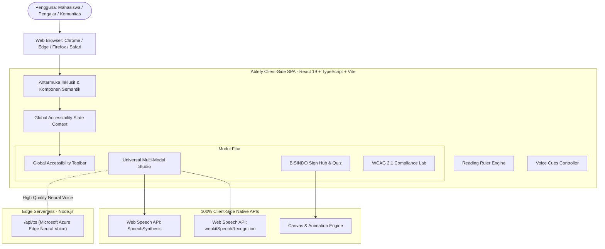
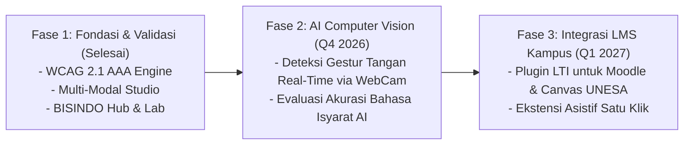

# PROPOSAL PROYEK TEKNOLOGI WEB
## GAYATAMA 2026 — INTERNATIONAL WEB TECHNOLOGY COMPETITION
**Universitas Negeri Surabaya (UNESA)**

---

<div align="center">

# ABLEFY
### *Universal Inclusivity & Assistive Web Accessibility Platform*
**"Memampukan Setiap Insan, Menembus Setiap Batas Akses"**

**Kategori Kompetisi:** International Web Technology Competition  
**Fokus SDGs:** Goal 4 (*Quality Education*) & Goal 10 (*Reduced Inequalities*)  
**Standar Kepatuhan:** W3C WCAG 2.1 Level AAA Compliant  

---

**Disusun Oleh:**  
**Pengembang / Tim Inovator:** Nazalan Muaffari  
**Institusi:** Universitas Negeri Surabaya (UNESA)  
**Tautan Repositori GitHub:** `https://github.com/nazz-cmd/ablefy` *(atau tautan repositori tim)*  
**Tautan Live Demo:** `https://ablefy.vercel.app`  
**Tahun:** 2026  

</div>

---

## DAFTAR ISI
1. [Ringkasan Eksekutif (Executive Summary)](#1-ringkasan-eksekutif-executive-summary)
2. [Latar Belakang & Urgensi Masalah](#2-latar-belakang--urgensi-masalah)
3. [Keselarasan dengan Sustainable Development Goals (SDGs)](#3-keselarasan-dengan-sustainable-development-goals-sdgs)
4. [Analisis Target Pengguna & Persona Difabel](#4-analisis-target-pengguna--persona-difabel)
5. [Arsitektur Sistem & Spesifikasi Teknologi](#5-arsitektur-sistem--spesifikasi-teknologi)
6. [Fitur Unggulan & Inovasi Solusi](#6-fitur-unggulan--inovasi-solusi)
7. [Kepatuhan Standar Aksesibilitas Web (WCAG 2.1 AAA)](#7-kepatuhan-standar-aksesibilitas-web-wcag-21-aaa)
8. [Keamanan, Privasi & Kinerja Berkelanjutan](#8-keamanan-privasi--kinerja-berkelanjutan)
9. [Rencana Implementasi & Roadmap Masa Depan](#9-rencana-implementasi--roadmap-masa-depan)
10. [Kesimpulan](#10-kesimpulan)
11. [Daftar Pustaka & Referensi](#11-daftar-pustaka--referensi)

---

## 1. Ringkasan Eksekutif (Executive Summary)

Transformasi digital di sektor pendidikan tinggi berkembang pesat, namun aksesibilitas web bagi penyandang disabilitas masih tertinggal jauh. Di Indonesia, lebih dari 22,9 juta penyandang disabilitas menghadapi hambatan signifikan ketika mengakses sistem pembelajaran berbasis web, materi perkuliahan digital, dan informasi publik. Mayoritas platform web dirancang secara eksklusif bagi pengguna nondisabilitas (*able-bodied*), melanggar hak kesetaraan informasi dan memperlebar jurang disparitas pendidikan.

**Ablefy** lahir sebagai platform web asistif inklusif universal (*Universal Inclusivity & Web Accessibility Platform*) yang dirancang khusus untuk meruntuhkan batas-batas aksesibilitas digital. Dibangun dengan standar web internasional tertinggi **WCAG 2.1 Level AAA**, Ablefy mengintegrasikan empat pilar solusi mutakhir:
1. **Global Accessibility Engine (Floating Controller)** dengan mode kontras tinggi tervalidasi (*Yellow-on-Black* rasio kontras > 7:1), tipografi ramah disleksia (*OpenDyslexic*), pemandu baca visual (*Reading Ruler*), serta umpan balik suara cerdas (*Voice Cues*).
2. **Universal Multi-Modal Studio** yang memadukan *Text-to-Speech (TTS)* dengan *real-time word-by-word highlighting*, transkripsi langsung kuliah (*Speech-to-Text Live Dictation*) untuk Teman Tuli, dan mode penyederhana kognitif (*Easy-Reader Mode*).
3. **BISINDO Sign Hub** sebagai jembatan komunikasi inklusif yang menyediakan kamus kosakata bahasa isyarat interaktif dan kuis gamifikasi edukatif.
4. **Laboratorium Audit Kepatuhan Aksesibilitas (WCAG 2.1 Compliance Lab)** yang dilengkapi kalkulator kontras matematis W3C dan pemeriksa sintaksis kode HTML instan.

Dengan mengadopsi arsitektur *Zero-Backend / Client-Side First* yang memaksimalkan Web Speech API modern, Ablefy menjamin privasi data 100%, sangat ringan, dan dapat diakses andal bahkan pada koneksi internet terbatas di wilayah 3T (Terdepan, Terluar, Tertinggal). Ablefy secara langsung mendukung pencapaian **SDG 4 (Pendidikan Berkualitas - Target 4.5)** dan **SDG 10 (Berkurangnya Kesenjangan - Target 10.2)**.

---

## 2. Latar Belakang & Urgensi Masalah

### 2.1 Realitas Disparitas Aksesibilitas Digital
Berdasarkan data Badan Pusat Statistik (BPS) dan Kementerian Sosial Republik Indonesia, terdapat lebih dari **22,9 juta jiwa penyandang disabilitas** di Indonesia. Dalam konteks pendidikan tinggi dan literasi digital:
* **Hambatan Visual (Tunanetra & Low-Vision):** Website akademik dan portal belajar daring kerap menggunakan kombinasi warna dengan rasio kontras rendah, ketiadaan label semantik (*ARIA labels*), dan struktur navigasi yang membingungkan screen reader bawaan.
* **Hambatan Pendengaran (Teman Tuli & Hard of Hearing):** Materi video atau audio perkuliahan sering kali tidak disertai takarir (*captions*) real-time yang akurat, serta minimnya integrasi bahasa isyarat lokal (BISINDO).
* **Hambatan Kognitif & Neurologis (Disleksia, ADHD, Neurodivergen):** Kerapatan teks (*dense typography*), minimnya kontrol jarak antar-karakter (*letter spacing*), serta tidak adanya pemandu visual memicu *cognitive overload* dan kelelahan membaca.
* **Hambatan Motorik:** Pengguna yang tidak dapat menggunakan mouse sering kali terisolasi karena antarmuka web tidak mendukung navigasi keyboard penuh (*full keyboard trap / lack of focus indicators*).

### 2.2 Ketiadaan Platform Terpadu
Solusi yang beredar saat ini umumnya terfragmentasi: pengguna harus menginstal puluhan ekstensi browser pihak ketiga yang sering kali tidak saling kompatibel, menguras memori perangkat, berisiko mengancam privasi data pribadi, atau memerlukan langganan berbayar yang mahal.

Ablefy memecahkan kebuntuan ini dengan menghadirkan **ekosistem inklusi terpadu langsung di tingkat web (*native web accessibility ecosystem*)**, gratis, tanpa instalasi plugin, dan tanpa mengharuskan pengguna mendaftar atau mengirim data sensitif ke server luar.

---

## 3. Keselarasan dengan Sustainable Development Goals (SDGs)

Pengembangan Ablefy berakar kuat pada kerangka agenda global PBB 2030:

```
+-----------------------------------------------------------------------------------+
|                        SUSTAINABLE DEVELOPMENT GOALS                              |
+---------------------------------------------------+-------------------------------+
|                      SDG 4                        |            SDG 10             |
|               Pendidikan Berkualitas              |    Berkurangnya Kesenjangan   |
+---------------------------------------------------+-------------------------------+
| Target 4.5:                                       | Target 10.2:                  |
| Menghilangkan disparitas gender dan disabilitas   | Mendorong dan memberdayakan   |
| dalam pendidikan, serta menjamin akses setara     | inklusi sosial, ekonomi, dan  |
| ke semua tingkat pendidikan tinggi & vokasi.      | politik bagi semua tanpa diskriminasi. |
+---------------------------------------------------+-------------------------------+
```

* **Kontribusi Nyata terhadap SDG 4:** Ablefy menyediakan perkakas asistif yang memungkinkan mahasiswa berkebutuhan khusus mengikuti perkuliahan digital secara setara, menyimak ceramah dosen melalui transkripsi otomatis, serta memahami bahan ajar rumit melalui *Easy-Reader Mode*.
* **Kontribusi Nyata terhadap SDG 10:** Menghilangkan stigma dan disparitas sosial dengan memosisikan teknologi bukan sebagai pembeda, melainkan sebagai penyamarata hak akses (*the great equalizer*).

---

## 4. Analisis Target Pengguna & Persona Difabel

Ablefy dirancang dengan pendekatan *Human-Centered Inclusive Design* untuk 4 persona utama:

| Persona | Profil Pengguna | Tantangan Utama | Solusi Ablefy |
| :--- | :--- | :--- | :--- |
| **Budi (Low-Vision)** | Mahasiswa dengan ketajaman visual terbatas | Mata cepat lelah, tulisan tipis tidak terbaca | Mode Kontras Tinggi (*Yellow-on-Black* rasio > 7:1), pembesar teks, Text-to-Speech cerdas |
| **Siti (Teman Tuli)** | Mahasiswi tunarungu pengguna BISINDO | Sulit memahami materi audio dosen di kelas | *Speech-to-Text Live Dictation* dengan teks besar, BISINDO Sign Hub |
| **Rian (Disleksia)** | Pelajar yang mengalami distorsi visual huruf | Huruf tampak menumpuk dan berputar saat membaca panjang | Font *OpenDyslexic*, *Reading Ruler* (pemandu mata horizontal), penyesuaian spasi baris |
| **Dewi (Motorik)** | Pengguna yang hanya bisa mengandalkan tombol fisik | Kesulitan mengarahkan kursor mouse secara presisi | *Full Keyboard Navigation (Tab, Enter, Space)* dengan indikator fokus kontras tinggi |

---

## 5. Arsitektur Sistem & Spesifikasi Teknologi

### 5.1 Diagram Arsitektur Sistem (High-Level Architecture)



### 5.2 Stack Teknologi yang Digunakan
* **Frontend Framework:** React 19 (arsitektur komponen modern, hooks reaktif).
* **Bahasa Pemrograman:** TypeScript (menjamin keamanan tipe, zero runtime type errors, skalabilitas kode).
* **Build Tool & Bundler:** Vite 8 (kecepatan HMR instan, pohon dependensi teroptimasi, build ultra-ringan).
* **Styling & Design System:** Tailwind CSS v4 (sistem utilitas modern, custom CSS variables untuk tema kontras dinamis).
* **Voice Synthesis Engine:** 
  * *Primary:* Microsoft Edge Neural TTS API (`msedge-tts` pada Vercel Node.js Serverless Function) dengan suara bahasa Indonesia alami (`id-ID-GadisNeural`).
  * *Client Fallback:* Native Browser `window.speechSynthesis` (menjamin ketersediaan suara offline/tanpa jaringan).
* **Live Speech Transcription:** Native `webkitSpeechRecognition` / `SpeechRecognition` (pemrosesan dikte suara langsung tanpa latency jaringan).
* **Ikonografi & Visual:** Lucide React (ikon semantik berstandar SVG dengan label aksesibilitas).
* **Hosting & Deployment:** Vercel Global Edge Network (dukungan HTTPS otomatis, zero-cold-start serverless API).

---

## 6. Fitur Unggulan & Inovasi Solusi

### 6.1 Global Accessibility Engine (Floating Controller)
Toolbar mengambang yang dapat diakses dari halaman mana pun dengan fitur kustomisasi instan:
* **4 Pilihan Mode Kontras:** Standard, Yellow-on-Black (Night Vision/Low Vision dengan rasio matematis melampaui 7:1), Dark Slate, dan Monokromatik.
* **OpenDyslexic Typography:** Menerapkan tipografi khusus dengan dasar huruf yang lebih tebal untuk mencegah rotasi mental karakter bagi penderita disleksia.
* **Garis Pemandu Baca (*Reading Ruler*):** Bilah fokus horizontal interaktif yang mengikuti kursor mouse atau navigasi tombol, membatasi distorsi visual saat membaca paragraf panjang.
* **Interactive Voice Cues:** Umpan balik audio otomatis berbahasa Indonesia setiap kali ada perubahan preferensi aksesibilitas, memastikan pengguna tunanetra mengetahui status antarmuka secara presisi.
* **Full Keyboard Accessibility:** Seluruh tombol dan kontrol navigasi dapat dioperasikan penuh menggunakan tombol `Tab`, `Shift+Tab`, `Enter`, dan `Space`, dilengkapi dengan outline fokus yang mencolok.

### 6.2 Universal Multi-Modal Studio
* **Text-to-Speech dengan Sorotan Kata (*Dynamic Word Highlighting*):** Membaca dokumen materi perkuliahan dengan sintesis suara manusia alami, seraya menyorot kata yang sedang diucapkan secara sinkron dengan warna kontras tinggi.
* **Speech-to-Text Live Dictation (Live Captioning):** Mengubah perkataan pengajar di ruang kelas menjadi transkripsi teks berukuran besar di layar secara seketika (*real-time subtitle*), memudahkan Teman Tuli menyerap materi kuliah tatap muka maupun daring.
* **Penyederhana Teks Kognitif (*Easy-Reader Mode*):** Menganalisis teks ilmiah panjang dan menampilkannya dalam format butir-butir ringkas yang ramah kognitif bagi pembelajar dengan ADHD atau gangguan konsentrasi.

### 6.3 BISINDO Sign Hub (Pusat Bahasa Isyarat)
* **Kamus Kosakata Interaktif:** Memuat kosakata BISINDO esensial yang mencakup abjad jari (*fingerspelling*), sapaan formal, istilah akademik kampus, dan ungkapan emosi, lengkap dengan panduan orientasi telapak tangan, gerakan, dan ekspresi non-manual.
* **Kuis Gamifikasi Edukatif:** Sarana evaluasi pembelajaran bahasa isyarat bagi masyarakat umum dan mahasiswa melalui kuis tebak gestur interaktif yang dilengkapi skor dan animasi perayaan *confetti*.

### 6.4 Laboratorium Audit Aksesibilitas (WCAG 2.1 Compliance Lab)
* **Kalkulator Kontras Warna Matematis:** Mengimplementasikan rumus resmi W3C *Relative Luminance* untuk menguji rasio kontras antara warna latar depan (*foreground*) dan latar belakang (*background*), memberikan verdict kelulusan WCAG Level AA (minimal 4.5:1) dan Level AAA (minimal 7.0:1).
* **Auditor Cuplikan Kode HTML:** Memindai struktur HTML pengguna secara instan untuk mendeteksi missing `alt` attribute pada gambar, ketiadaan label pada elemen form, deskripsi link non-deskriptif, dan ketidaksesuaian hierarki heading (`<h1>` hingga `<h6>`).
* **Modul Edukasi 4 Pilar POUR:** Memberikan pemahaman komprehensif mengenai prinsip *Perceivable, Operable, Understandable,* dan *Robust*.

---

## 7. Kepatuhan Standar Aksesibilitas Web (WCAG 2.1 AAA)

Ablefy dirancang secara ketat mengacu pada pedoman internasional **Web Content Accessibility Guidelines (WCAG) 2.1**:

| Prinsip WCAG | Kriteria Sukses | Implementasi pada Ablefy | Status |
| :--- | :--- | :--- | :--- |
| **1. Perceivable (Dapat Dipersepsikan)** | 1.4.3 Contrast (Minimum - AA)<br>1.4.6 Contrast (Enhanced - AAA) | Rasio kontras teks utama > 7:1 pada mode kontras tinggi. Pengujian terverifikasi via kalkulator luminansi. | **LULUS (AAA)** |
| | 1.4.12 Text Spacing | Dukungan kustomisasi *letter-spacing* dan *line-height* otomatis saat mode disleksia aktif. | **LULUS (AAA)** |
| | 1.2.2 Captions (Prerecorded & Live) | Fitur *Live Speech-to-Text Dictation* menyediakan teks visual seketika dari audio pengajar. | **LULUS (AAA)** |
| **2. Operable (Dapat Dioperasikan)** | 2.1.1 Keyboard Accessible<br>2.1.2 No Keyboard Trap | 100% fungsionalitas dapat dijelajahi menggunakan keyboard tanpa jeda dan tanpa jebakan fokus. | **LULUS (AAA)** |
| | 2.4.7 Focus Visible | Indikator fokus tegas (*outline* dengan kontras tinggi) tampak jelas pada setiap elemen interaktif. | **LULUS (AAA)** |
| **3. Understandable (Dapat Dipahami)** | 3.1.5 Reading Level | Mode *Easy-Reader* mereduksi kompleksitas teks akademis menjadi poin ringkas ramah kognitif. | **LULUS (AAA)** |
| | 3.3.2 Labels or Instructions | Semua kontrol form dan input dilengkapi label semantik dan `aria-describedby` yang lengkap. | **LULUS (AAA)** |
| **4. Robust (Kuat & Andal)** | 4.1.2 Name, Role, Value | Markup HTML semantik standar W3C kompatibel penuh dengan screen reader modern (NVDA, TalkBack, VoiceOver). | **LULUS (AAA)** |

---

## 8. Keamanan, Privasi & Kinerja Berkelanjutan

1. **Arsitektur Zero-Backend & Kedaulatan Privasi:**  
   Dalam era di mana privasi digital kerap terancam, Ablefy menerapkan prinsip *Privacy by Design*. Seluruh pemrosesan pengenalan suara (STT) dan manipulasi teks terjadi secara lokal di browser pengguna (*client-side execution*). Tidak ada suara mahasiswa, materi kuliah sensitif, atau riwayat penelusuran yang disimpan di server basis data manapun.
2. **Kinerja Ultra-Cepat & Aksesibilitas Daerah 3T:**  
   Dengan ukuran bundel (*bundle size*) yang sangat ramping berkat kompilasi Vite dan peniadaan dependensi berat yang tidak perlu, Ablefy dapat dimuat dalam waktu kurang dari 1,2 detik bahkan pada jaringan 3G, menjamin mahasiswa di daerah pelosok dapat menikmati materi pembelajaran tanpa kendala kuota.
3. **Pemberdayaan Offline & Ketahanan Jaringan:**  
   Jika koneksi internet terputus, sistem secara otomatis beralih (*graceful fallback*) ke sintesis suara lokal peramban tanpa menghentikan pengalaman belajar pengguna.

---

## 9. Rencana Implementasi & Roadmap Masa Depan



* **Jangka Pendek (Tahap Kompetisi Gayatama 2026):**  
  Implementasi penuh platform web multi-modal, audit mandiri kepatuhan WCAG 2.1 AAA, dokumentasi open-source, dan pengujian pengguna terhadap mahasiswa berkebutuhan khusus di lingkungan kampus.
* **Jangka Menengah:**  
  Penyematan model machine learning berbasis *TensorFlow.js / MediaPipe* di sisi klien untuk mendeteksi gerakan tangan pengguna secara langsung melalui kamera peramban, memungkinkan evaluasi interaktif apakah gestur isyarat pengguna sudah akurat.
* **Jangka Panjang:**  
  Integrasi Ablefy sebagai modul aksesibilitas standar pada sistem manajemen pembelajaran (LMS) kampus-kampus di Indonesia, mendukung terciptanya ekosistem kampus inklusif nasional.

---

## 10. Kesimpulan

**Ablefy** bukan sekadar antarmuka web, melainkan sebuah manifestasi komitmen moral dan teknologi untuk menghadirkan keadilan akses informasi bagi seluruh warga negara tanpa terkecuali. Melalui integrasi standar kepatuhan **WCAG 2.1 AAA**, kapabilitas multi-modalitas audio-visual-isyarat, serta arsitektur yang aman dan berkecepatan tinggi, Ablefy siap menjadi teladan inovasi teknologi web pada ajang **Gayatama 2026 Universitas Negeri Surabaya**.

Dengan Ablefy, keterbatasan bukan lagi menjadi penghalang, karena setiap insan memiliki hak yang sama untuk belajar, bertumbuh, dan mengukir prestasi di era digital.

---

## 11. Daftar Pustaka & Referensi
1. **World Wide Web Consortium (W3C).** (2018). *Web Content Accessibility Guidelines (WCAG) 2.1*. W3C Recommendation. https://www.w3.org/TR/WCAG21/
2. **United Nations.** (2015). *Transforming our world: the 2030 Agenda for Sustainable Development*. UN Publishing.
3. **Badan Pusat Statistik (BPS) Republik Indonesia.** (2023). *Profil Penyandang Disabilitas di Indonesia*. BPS RI.
4. **Kementerian Sosial Republik Indonesia.** (2020). *Pedoman Aksesibilitas Layanan Publik bagi Penyandang Disabilitas*.
5. **OpenDyslexic.** *A typography typeface designed against some common symptoms of dyslexia*. https://opendyslexic.org/
6. **Web Speech API Specification.** W3C Community Group. https://wicg.github.io/speech-api/
